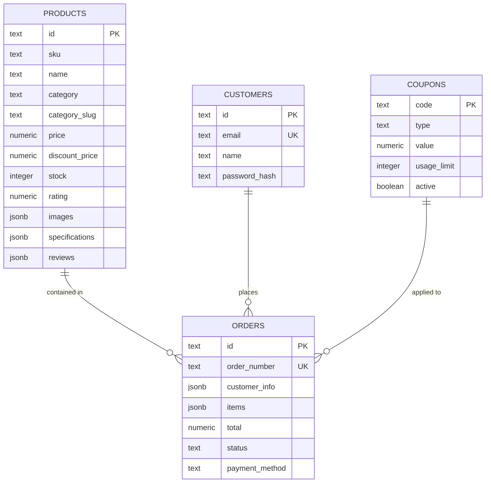

# MERIS E-SHOP — Architectural & Technical Guide

---

## 📌 Module 1: Project Overview & Technology Stack

**MERIS E-SHOP** is an e-commerce platform built for high speed, luxury aesthetics, and multi-tenant catalog management.

### Tech Stack Matrix

| Layer | Technology | Key Responsibility |
| :--- | :--- | :--- |
| **Frontend UI** | React 19 + Vite | High-performance Single Page Application (SPA) |
| **Styling** | Vanilla CSS + Tailwind CSS | Luxury dark mode UI, glassmorphism, dynamic gold accents |
| **Icons & Motion** | Lucide React + Framer Motion | Smooth layout transitions, micro-animations, interactive drawers |
| **Backend API** | Node.js + Express | REST API, authentication gate, image processing, SMTP email engine |
| **Database** | Supabase (PostgreSQL) | Primary relational cloud storage with Row Level Security (RLS) |
| **AI Intelligence** | Google Gemini AI API | Smart product search & personalized recommendations |
| **Hosting Platform** | Railway.app | Dedicated Node container with 0 cold starts and <100ms API response times |

---

## 🗄️ Module 2: Database Schema & Data Models

All primary application data is stored in Supabase PostgreSQL tables:

---

## 🔐 Module 3: Authentication, Security & Performance Systems

### 1. Dual Authentication Architecture
- **Password Authentication**: Asynchronous `bcryptjs` hashing with 10 salt rounds and 32+ character JWT session tokens stored in secure HTTP cookies.
- **Email OTP Safe**: 6-digit one-time passcodes generated and dispatched in <1.6 seconds via Gmail SMTP with non-blocking background dispatch.

### 2. Network & Performance Optimizations
- **IPv4 DNS Forcing**: Forced IPv4 resolution (`dns.setDefaultResultOrder('ipv4first')`) to eliminate 9.3-second IPv6 SMTP connection timeouts on cloud hosts.
- **Memory Rate Limiting**: Customized IP rate limiting to prevent brute-force attacks on login, registration, and OTP endpoints.

---

## 🛍️ Module 4: E-Commerce Workflows & Admin Workspace

### 1. Customer Shopping Experience
- **Catalog Navigation**: Multi-category filtering, sort options (price, stock, rating), and real-time search.
- **Cart & Checkout**: Interactive cart drawer, discount coupon application, gift wrapping selection, and automated order invoice generation.

### 2. Secured Admin Workspace (`/admin`)
- **Product Management**: Real-time product creation, duplication, stock updates, and price adjustments synchronized directly to Supabase.
- **Coupon & Campaign Control**: Active promotional code configuration (`MERIS10`, `FESTIVE20`) and banner campaign updates.

---

## 🚀 Module 5: Resilience, Error Recovery & Deployment

### 1. Crash Resilience Framework
- **`sanitizeProduct()` Guard**: Guarantees all product properties (prices, image URLs, ratings, categories) are strictly validated before component rendering.
- **Global `<ErrorBoundary>`**: Catches unexpected rendering exceptions and provides a 1-click workspace recovery option (`localStorage.clear()`).

### 2. Railway.app Cloud Hosting
- Dedicated container hosting on **Railway.app** ensuring **0 cold starts**, **24/7 continuous availability**, and instant `/health` check probes (<1ms).
